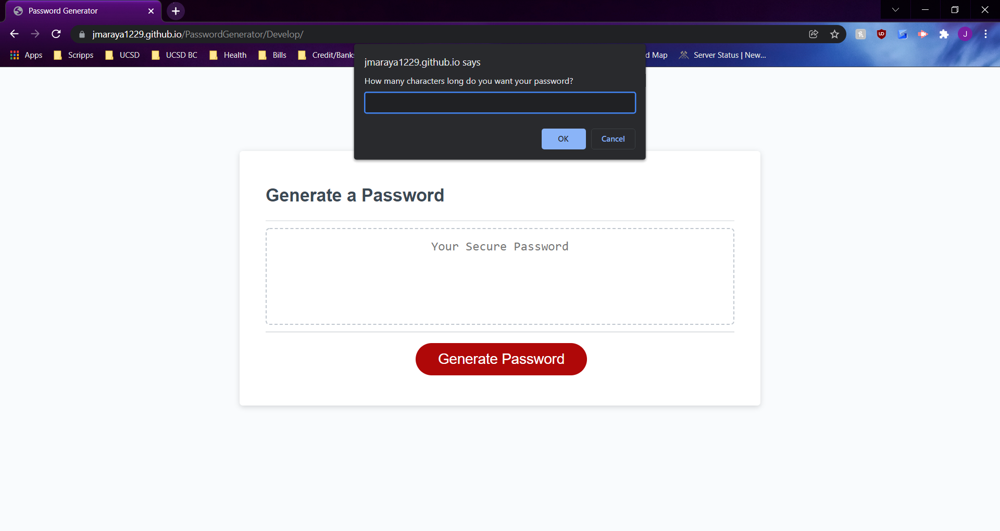

# PasswordGenerator

## The Task
The purpose of this application is to create a randomly generator password for the user given a specific criteria. The user is able to adjust parameters to receive a randomly generated password that is 8 - 128 characters in length and may include lowercase letters, uppercase letters, numbers, and/or symbols. 

## Functionality
* On the webpage, the user will see a display box where the new password will be presented. 
* When the user clicks the "Generate Password" button, they will be directed to a series of window prompts where they will be required to fill out the criteria of the password that they want. The user will have the choice to pick a password length of 8 - 128 characters in length then they may choose from different character types: lowercase letters, uppercase letters, numbers, and/or symbols. 
* After the user picks their choices, the randomly generated password will appear in the display box on the main webpage.
* If the user does not like the given password after fulfilling the required criteria, they may try to make another password by pressing the "Generate Password" button again. 
* If the user were to choose a character length number outside of the given parameters or did not choose at least one of the four given character types for the password generator, they will receive an "invalid response" alert and a silly message on the password display box telling them to try again. 

## Screenshot of webpage usage

## URL
* https://jmaraya1229.github.io/PasswordGenerator/Develop/